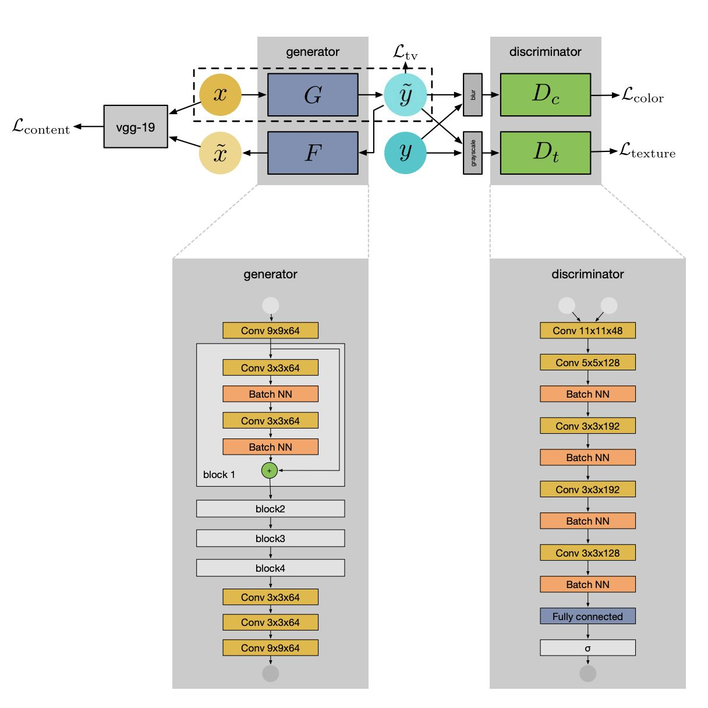
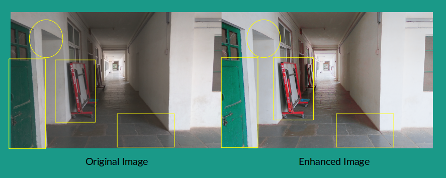
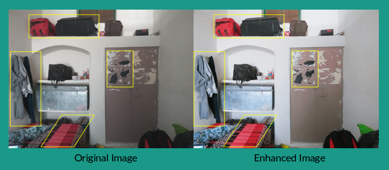

# Implementation of the CVPR 2018 paper titled "Weakly Supervised Photo Enhancer for Digital Cameras" in Keras with TensorFlow Backend

This repo contains the Keras implementation of the research paper [Weakly Supervised Photo Enhancer for Digital Cameras](https://openaccess.thecvf.com/content_cvpr_2018_workshops/w13/html/Ignatov_WESPE_Weakly_Supervised_CVPR_2018_paper.html), also known as WESPE. It was done for the partial fulfillment of the on-campus course Neural Networks and Fuzzy Logic (BITS F312).

## Objective:

Clicking pictures has become an extremely popular thing with the rise of numerous social media sites. Compact mobile cameras demonstrate limited
photo quality mainly due to space, hardware and budget constraints. WESPE is a photo enhancement tool that uses the power of deep learning to transform images taken from such mobile devices into DSLR quality pictures.

## What does Weakly-Supervised mean?

WESPE is trained under weak supervision i.e. there is no need for strong supervision in the form of a large annotated dataset of aligned original/enhanced photo pairs. The sole requirement is two distinct datasets: one from the source camera, and one composed of arbitrary high-quality images that can be generally crawled from the Internet – the visual content they exhibit may be unrelated. This makes WESPE generalizable for any camera and also makes the process of data collection extremely fast.

## Network Architecture:

Basically, WESPE is a Generative Adversarial Network (GAN). It consists of a generator `G` that maps original image space to enhanced image space. It also consists of an inverse generator `F` that reconstructs the original image from the enhanced image (for cyclic consistency loss, as mentioned below). It consists of two adversarial discriminator networks: `Dc`, responsible for distinguishing high-quality real images and enhanced images based on color, and `Dt`, responsible for distinguishing high-quality real images and enhanced images based on texture. The images are passed through a gaussian blur operation before being passed on to `Dc` and through a grayscale operation before being passed on to `Dt`. The following figure (taken from the [paper](https://arxiv.org/abs/1709.01118)) depicts the architecure of WESPE:

## Loss Function:

WESPE consists of a combination of the following four loss functions:

1. Content consistency loss: Pre-trained VGG-19 model is used as images' features extractor to compute L2-norm between feature representations of  original and reconstructed images. It circumvents the need of strong supervision.
2. Adversarial color loss: `Dc` measures image color quality (while avoiding image texture and content) to differentiate between blurred versions of high-quality and enhanced images. It is defined as the standard generator objective used in GAN training (i.e. binary cross entropy loss function).
3. Adversarial texture loss: `Dt` measures image texture quality (while avoiding image color and content) to differentiate between grayscale versions of high-quality and enhanced images. It is defined as the standard generator objective used in GAN training (i.e. binary cross entropy loss function).
4. Total variation loss: It imposes spatial smoothness in the enhanced images generated by `G`.

**Note: We also tried pre-trained MobileNetV2 for image feature extraction, as its computationally cheaper than VGG-19.**

## Dataset:

[DPED](http://people.ee.ethz.ch/~ihnatova/) dataset was used for training WESPE. Specifically, training set images taken using iPhone 3GS were used as original images and training set images taken using Canon 70D DSLR were used as high-quality images. The dataset was downloaded to Kaggle, and the entire project was performed on Kaggle. The file `WESPE_GAN.ipynb` contains the code to train WESPE.

## Evaluation metric - Flickr Faves Score (FFS):

Flickr is a popular photo sharing website that gives the privilege to users to “favorite” an image. Flickr Faves Score (FFS) involves training and creating a virtual rater that mimics the user behavior on Flickr. It works under the assumption that users tend to favorite higher quality images more.

FFS dataset is collected by crawling the Flickr website (using Flickr API) and downloading search results with the "Street" tag. FFS for an image is calculated as no. of times it was fav'ed over no. of times it was viewed. Then, images having FFS higher than median value were labelled as `1` and the rest images were labelled as `0`. VGG-19 (pretrained on ImageNet) is then finetuned to predict FFS of an image given a `256 x 256` crop of the image (because it is computationally infeasible to train the VGG network on high resolution images, and downscaling would remove image details). For predicting FFS of an image at inference time, an average over five image crops is taken to calulate the final FFS of the image. 

The file **`Flickr_Faves_Score.ipynb`** contains the code to train VGG-19 for computing Flickr Faves Score.

## Challenging Aspects in Keras Implementation:

The following two aspects were found to be slightly challenging/tricky for developing code for WESPE in Keras (since Keras is more of a high-level API, rather than a full-fledged scientific computing framework like TensorFlow or PyTorch):

1. WESPE consists of a custom loss function, that consists of four component losses (as described above). By default, Keras is more suitable for standard loss functions (like cross-entropy, mean-squared-error, etc.). It was some task to implement the custom loss function correctly for WESPE.
2. WESPE is implemented using Keras Functional API to create models, which expects model inputs and outputs and itself takes care of the training loop (using methods like `train_on_batch()` etc.). This, combined with the facts that WESPE has a custom loss function, two discriminators (instead of the normal one) and generator (and inverse generator) and discriminators needing to be trained alternatively, make it tricky to implement WESPE in Keras using Functional API.

Overall, it was quite a learning experience in implementing WESPE in Keras.

## Original and Enhanced Image Pairs using WESPE:

Below figures show some pictures of **my hostel room** enhanced using WESPE. These were generated using a pre-trained WESPE model, since we didn't have enough compute power to train WESPE. Moreover, many other people found WESPE training to be quite unstable (as highlighted by many GitHub issues, one of them being [this](https://github.com/TropComplique/WESPE/issues/1)).

This work was done in a team of three, with my teammates being [Megh Thakkar](https://github.com/Megh-Thakkar) and [Aayush Chudgar](https://github.com/aayushbleedblu).

